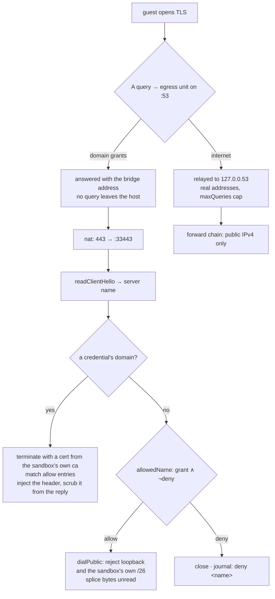
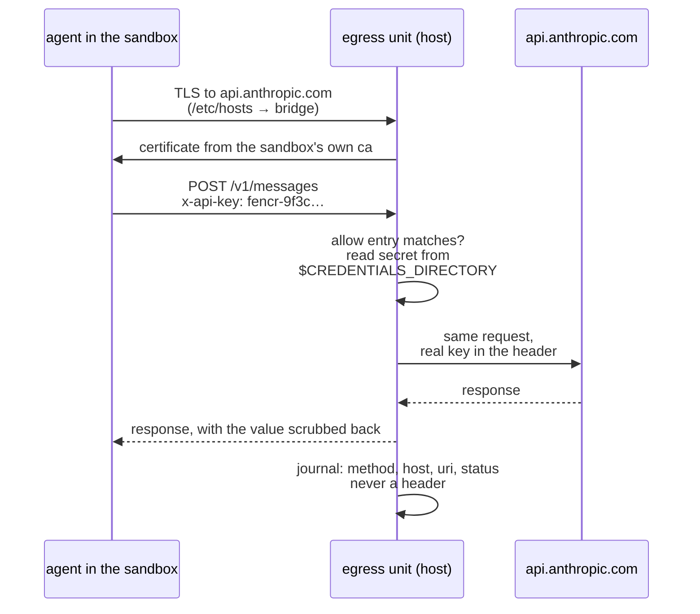

# how fencr works

A machine declares `fencr.sandboxes.<name>`, hands it NixOS modules through
`services`, and gets a sandbox with one road out that the host decides. The
sandbox is the units below taken together; the microVM is the one the payload
runs in.
Every host change goes through `nixos-rebuild` — the `fencr` command never
touches host configuration. It looks, checkpoints, restores, and opens a shell
as guest root.

Everything derives from the instance's `id`: subnet, mac, vsock cid, unit
names and paths. Two roads connect host and guest — the bridge carries all
traffic, vsock carries only boot secrets and the power button.

## one sandbox, end to end

On the host, at `10.11.<id>.1`:

| unit | what it is |
| --- | --- |
| `fencr-<sandbox>.service` | firecracker as user `fencr-<sandbox>`, empty read-only tmpfs root, `/dev/kvm` and `/dev/net/tun` as its only devices, `IPAddressDeny=any` |
| `fencr-<sandbox>-egress.service` | the road out: DNS on `:33053`, TLS on `:33443`, `DynamicUser`, credentials through `LoadCredential` |
| `fencr-<sandbox>-secrets@.service` | socket-activated on vsock port 5, tars the sandbox's raw secrets to the guest |
| `fencr-<sandbox>-trust@.service` | socket-activated on vsock port 6, tars the sandbox's own ca certificate to the guest |
| `fencr-<sandbox>-checkpoint@.service` | `cp --reflink` of the state image; timer optional, `ExecStopPost` by default |
| `fencr-<sandbox>-ca.service` | the sandbox's own certificate authority, in `/var/lib/fencr/ca/<sandbox>`, only when it holds credentials |

Host-wide: `fencr-credentials-reload`, `fencr-secret-<name>@` and
`fencr-mcp-gateway`.

In the guest, at `10.11.<id>.2`, vsock cid `3 + id`:

- payload modules from `fencr.sandboxes.<name>.services`. fencr ships no agent;
  they read the contract from `specialArgs.agentSandbox`
- sshd on `10.11.<id>.2:22`, only when keys exist. Guest root is the
  intended privilege level
- `/` is `state.img`, persisting across reboot and rebuild. `/nix/store` is
  a fresh read-only erofs image each rebuild, not a host store share
- `/run/agent-secrets` holds raw secrets at mode 0400, and `/run/fencr`
  holds the sandbox's own authority rebuilt into the trust store at boot
- journald stays inside the sandbox; serial output is discarded on the host

The bridge is `br-<sandbox>` and `tap-<sandbox>` on `10.11.<id>.0/26`. vsock carries
port 4 for the power button, port 5 for raw secrets and port 6 for the
authority, and nothing else.

## what happens to one outbound connection

The guest's resolver is always its own egress unit. Every name it opens TLS
to is judged by the server name in the client hello — never decrypted for a
plain grant, always terminated for a credential's domain.



Outbound defaults to `[ "internet" ]` — public IPv4 and DNS, private ranges
still closed. Setting it replaces that default; `[ ]` leaves no egress at all:

```nix
outbound = [
  "github.com"           # TLS 443 by name
  "*.github.com"         # not github.com itself
  "!gist.github.com"     # a carve-out inside the wildcard
  "host:8080"            # the host, on any address the bridge routes to
  "192.168.1.0/24:8123"
  "internet"             # cannot accompany domain grants
];
```

The sandbox gets two nftables tables of its own, so no host chain runs ahead of
them:

- `fencr-<sandbox>`, family `inet`, at priority `filter - 1`: `forward` for what
  the guest reaches, `input` for what it reaches on the host, `output` for
  what the host reaches in it
- `fencr-<sandbox>-nat`, family `ip`: `prerouting` redirects 53 and 443 to
  `:33053` and `:33443`, `postrouting` masquerades

Every drop is logged as `fencr:<sandbox>:<kind>` at 5/second and counted without
a limit, so the journal is a sample and the counter is the total.

Refused at runtime:

- IPv6 anywhere on the bridge
- port 53 elsewhere, once the unit answers DNS and only then; a destination
  grant naming that resolver is still accepted first
- special-use ranges under `"internet"`
- a granted name resolving to loopback
- a granted name resolving into the sandbox's own `/26`
- more than `maxConnections` per chain

## the other direction, and what never gets built

`inbound` is the way in:

```nix
inbound = [ 9119 ];
```

These are guest TCP ports any host process may reach at `10.11.<id>.2`. The
output chain opens those ports and nothing else. It does not authenticate:
every host process can connect, so the guest service must provide its own
auth. Nothing is published to the LAN.

SSH is separate. A door exists only when `fencr.adminKeys` or
`fencr.sandboxes.<name>.authorizedKeys` supply a key — no keys, no listener, no
pinhole, and `fencr ssh` refuses by name rather than letting it fall through
to DNS.

`resolveInstance` returns errors that become assertions, so these never
reach a running sandbox:

- `"internet"` beside domain grants
- a deny entry no grant covers, which is a typo
- a deny entry equal to a grant, which would empty it
- an outbound entry that does not parse, reported with the reason
- two sandboxes sharing an `id`
- an `inbound` port declared twice
- a credential that is not declared, is reserved, or carries both
  `secretFile` and `secretCommand`
- credentials sharing a domain without `allow` entries
- a sandbox name outside letters, digits, `_` and `-`, or longer than 11
  characters, since every derived name is this one with a prefix and
  `tap-<name>` must fit `IFNAMSIZ`

## a credential the sandbox uses and never holds



Declared once on the host:

```nix
fencr.credentials.anthropic = {
  # the provider preset fills upstream and header
  secretFile = "/run/secrets/key";
  # or secretCommand, served by a socket
  allow = [ "POST /v1/messages" ];
};
fencr.sandboxes.agent.credentials = [ "anthropic" ];
```

Each sandbox has its own certificate authority, so a certificate minted for one is
worthless against another.

The guest gets a placeholder, not a key: `guestEnv` carries `fencr-<hash>`,
which satisfies a client that refuses to start without one. The host sets the
real header itself, so that placeholder never has to be substituted anywhere.
`substitutePlaceholder = true` additionally replaces it in the uri or a small
body, for an api that takes the key there instead of in a header — off by
default, because the header path already covers every provider preset and
leaves the value in fewer places.

Either way, an upstream that echoes a request back would hand the guest the
real value in its reply, so the proxy rewrites it to the placeholder on the
way out: response headers, and bodies up to 1 MiB.

Raw `secrets` are the other door, for keys a program must hold itself. They
are fetched over vsock at boot into `/run/agent-secrets`, readable by guest
root.

MCP rides the same rail: `https://mcp.fencr/mcp/` with a per-sandbox token the
host injects, into a gateway that filters `<server>.<tool>`. Under the
default `approvalMode = "host"` it runs `approvalCommand` for every tool
matching `approvalTools`, `[ "*" ]` by default. `"client"` mode asks the
requesting client instead, which means a compromised client can approve its
own calls.

## where it lives

```
modules/
├── default.nix        # composes the host: units, net, firewall
├── options.nix        # fencr.sandboxes, fencr.credentials
├── mcp-gateway.nix    # the optional host gateway
└── core/              # pure builders, one fixed point
    ├── instance.nix   # resolveInstance, names, errors
    ├── firewall.nix   # the sandbox's nftables tables
    ├── egress.nix     # config, credentials, authority
    ├── microvm.nix    # the microvm's unit: firecracker under systemd
    ├── guest.nix      # guestBase and guest-fetch.sh
    ├── checkpoint.nix # the checkpoint units
    ├── host-units.nix # per-sandbox services, sockets, timers
    └── hardening.nix  # the sandbox sets

pkgs/
├── egress/        # go, stdlib only — dns, sni, splice, credentials
├── cli/           # go, instance tables generated at build
├── mcp-gateway/   # python, MCP SDK
└── domain.go      # the wildcard rule, shared by both go programs
```

The command:

```console
fencr list
fencr ssh <sandbox> [cmd]              # refuses without keys
fencr status [sandbox] [--watch|--full]
fencr checkpoint <sandbox> [name]
fencr checkpoints <sandbox> [--rm <name>]
fencr restore <sandbox> <name>         # stage, fsync, rename
```

`fencr status` reads the nft counters, the kernel journal, the egress
journal and each sandbox's firecracker API socket, and prints every grant as used
or unused.

The checks:

| check | what it covers |
| --- | --- |
| `formatting` | nixfmt, deadnix, statix, mdformat, gofmt |
| `core` | the pure builders, no host, nothing built |
| `cli` | the compiled binary against mocked tools |
| `egress` | `go test` in the package build |
| `mcp-gateway` | the gateway contract tests |
| `mcp-module` | gateway option wiring |
| `nixos-module` | builds a host toplevel |
| `nixos-boot` | a real guest under nested KVM |

## state and the way back

`/var/lib/fencr-sandboxes/<sandbox>/state.img` is the whole machine. It uses
firecracker's `Writeback` cache so guest flushes reach the host disk, and it
is never mounted on the host — `debugfs` reads it without the host kernel.

Copies live in `checkpoints/` beside it:

- `stop-<stamp>` after every clean stop, keeping 5
- `timer-<stamp>` on an optional calendar, keeping 5
- `<name>` on demand, kept until removed

A checkpoint is disk only, no memory, so a restore is a reboot. The sandbox is
never paused for one: the reflink is atomic on the file, which makes a
running sandbox's copy crash-consistent. `fencr restore` stages the copy beside
the image, fsyncs it and renames it over, so a restore that runs out of
space leaves the sandbox the disk it had.
